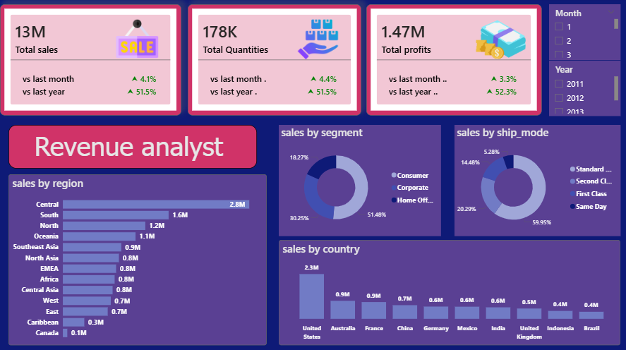

# Sales-supermarket-analyst
data analysis project using power bi to explore sales super market analyst 
## Data source :
from kaggel 
## Tools used :
Power Bi
## Project Question : 
How can supermarket sales data be analyzed to identify revenue drivers, evaluate product and customer performance, detect loss patterns, and support strategic business decisions ??
## Explore data :
the data contains 51291 rows and 21 columns 
## Clean data :
1. Removed columns that were not relevant to the analysis objectives.

2. Removed duplicate records, where applicable.

3. Validated the dataset for accuracy and filled missing values using appropriate statistical methods.

4. Standardized text data by converting all text to uppercase and removing unnecessary leading and trailing spaces to ensure consistency and prevent data matching errors.

5. The dataset is now clean and ready for analysis.
## data analysis :
                                              Dashboard1(revenue analyst)
                      

Revenue Analysis Insights

Sales Performance Overview

- The supermarket generated $13M in total sales, with 178K units sold, resulting in $1.47M in total profit.
- The overall results indicate strong sales performance while maintaining positive profitability across the business.

Sales by Shipping Mode

- Standard Class was the most frequently used shipping method, accounting for 60% of total sales.
- Second Class represented 20% of sales, followed by First Class with 15%.
- Same Day shipping contributed the remaining 5%.
- The dominance of Standard Class suggests that customers generally prefer cost-effective delivery options over faster shipping services.

Sales by Customer Segment

- The Consumer segment generated the largest share of sales, contributing 51% of total revenue.
- The Corporate segment accounted for 30% of sales.
- The Home Office segment represented 18% of total sales.
- These findings indicate that individual consumers are the supermarket's primary revenue source, while business customers also make a significant contribution.

Sales by Country

- The United States generated the highest sales, reaching $2.3M.
- The remaining countries in the Top 10 also contributed significantly to total revenue, as illustrated in the dashboard.
- This distribution highlights the company's strong international presence while identifying its highest-performing market.

Sales by Region

- The Central region recorded the highest sales, generating $2.8M in revenue.
- The remaining regions in the Top 10 also contributed to overall business performance, as shown in the dashboard.
- Comparing regional performance helps identify high-performing markets and supports strategic planning for future sales growth.

Business Recommendations

- Continue prioritizing the Consumer segment, as it represents the largest share of revenue.
- Maintain efficient Standard Class shipping services while exploring opportunities to improve the adoption of premium shipping options.
- Analyze the success factors behind the highest-performing countries and regions to replicate best practices in lower-performing markets.
- Allocate marketing and operational resources toward high-revenue regions while identifying opportunities for growth in underperforming areas.
                                      Dashboard2(Products & cutomers analyst)
                      

Product & Customer Analysis Insights

Customer and Order Overview

- The supermarket served a total of 795 customers and processed 51K orders.
- The high order volume indicates strong customer activity and consistent purchasing behavior across the business.

Profit Analysis by Category

- Technology generated the highest share of profit, contributing 45% of total profit.
- Office Supplies accounted for 35% of total profit.
- Furniture contributed the remaining 20%.
- These results indicate that Technology products are the most profitable category and should remain a strategic business focus.

Sales Analysis by Category

- Technology also generated the highest sales, representing 38% of total revenue.
- Furniture accounted for 33% of sales.
- Office Supplies contributed 30% of total sales.
- The close distribution across categories demonstrates a well-balanced sales portfolio, with Technology maintaining a slight competitive advantage.

Quantity Sold by Category

- Office Supplies represented the largest share of units sold, accounting for 61% of total quantity.
- Technology and Furniture each contributed approximately 20% of total quantity sold.
- Although Office Supplies generated the highest sales volume, Technology delivered higher profitability, suggesting stronger profit margins.

Most Profitable Sub-Categories

- The highest-profit sub-categories were:
  - Copiers ($259K)
  - Phones ($217K)
  - Bookcases ($162K)
  - Chairs ($142K)
  - Appliances ($142K)
- Other sub-categories also contributed to profitability, as shown in the dashboard.
- These products represent the strongest opportunities for maximizing business profit.

Best-Selling Sub-Categories by Quantity

- The highest-demand sub-categories were:
  - Binders (21K units)
  - Storage (17K units)
  - Art (16K units)
  - Paper (13K units)
  - Chairs and Phones (12K units each)
- The remaining sub-categories contributed to overall sales volume, reflecting a diversified product portfolio.

Top 10 Customers

- The highest-value customer was Tom Ashbrook, generating approximately $40K in sales.
- Other top customers included Tamara Chand, Greg Tran, Christopher Conant, Sean Miller, Bart Watters, Natalie Fritzler, Fred Hopkins, Jane Waco, and Hunter Lopez.
- Monitoring these high-value customers is essential for improving customer retention, loyalty, and long-term revenue growth.

Business Recommendations

- Continue investing in the Technology category, as it delivers the highest sales and profitability.
- Maintain sufficient inventory for high-demand Office Supplies products to avoid stock shortages.
- Develop customer loyalty programs targeting high-value customers to maximize customer lifetime value.
- Focus marketing campaigns on the most profitable sub-categories, particularly Copiers, Phones, and Bookcases.
- Balance inventory planning by considering both sales volume and profit margins, rather than relying on quantity sold alone.

